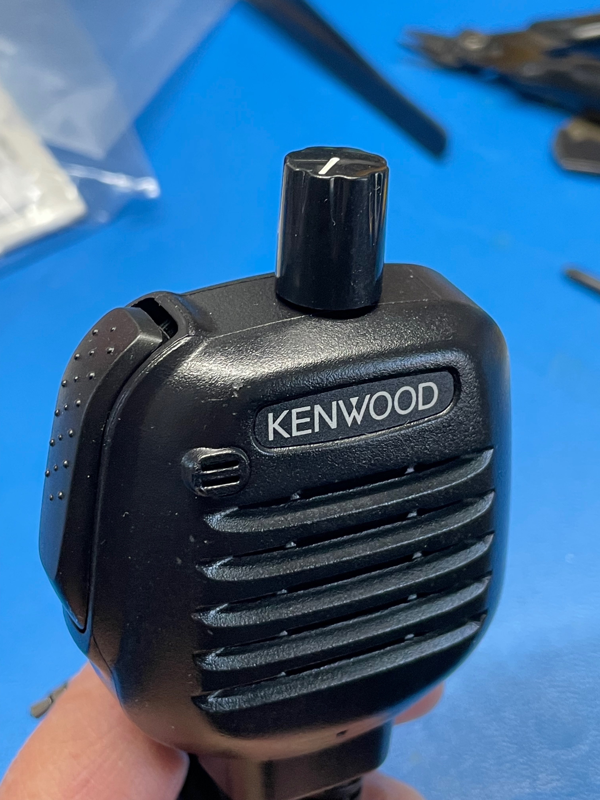
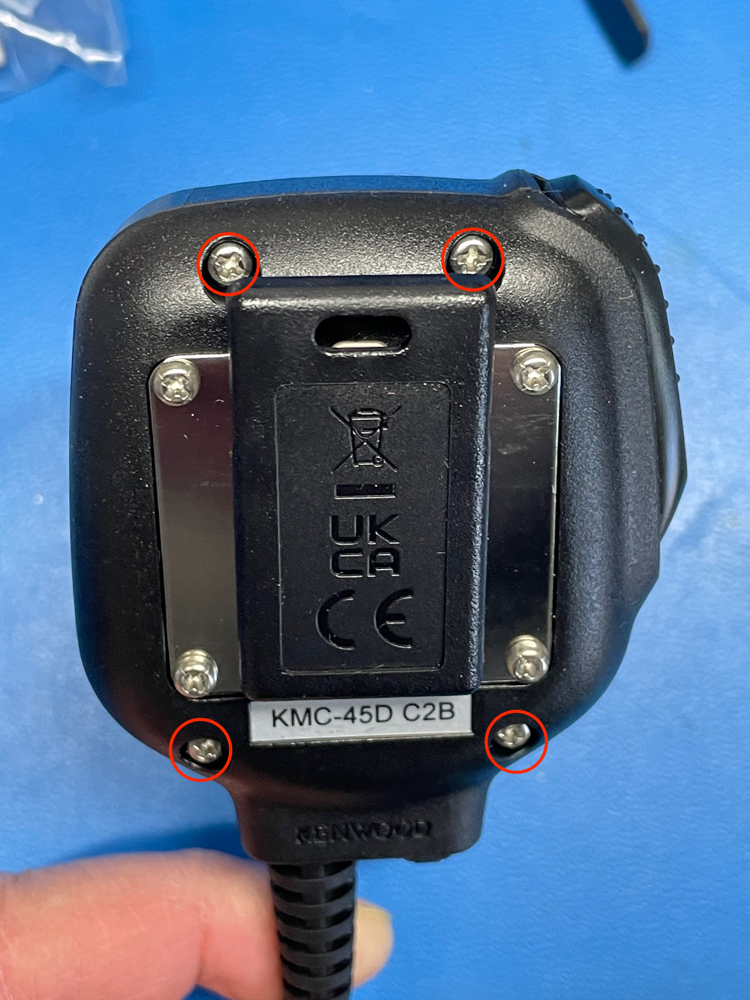
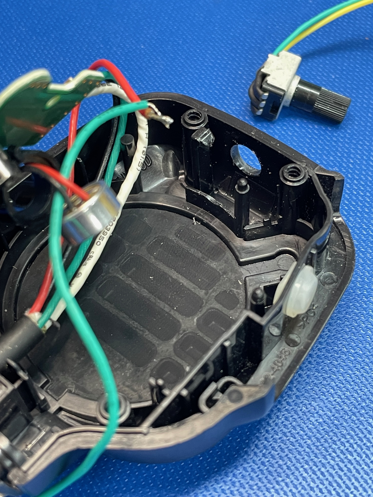
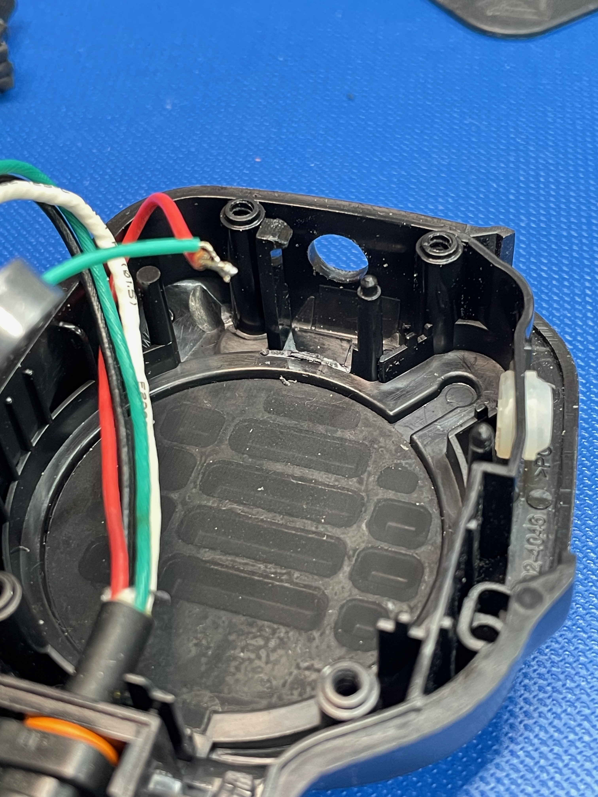
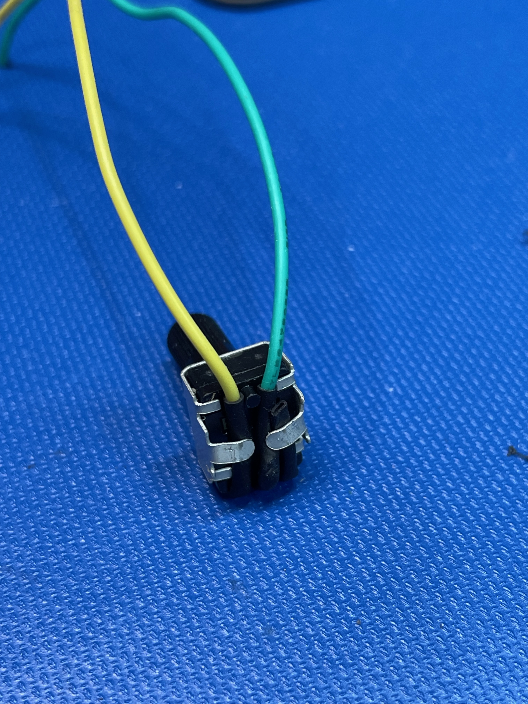
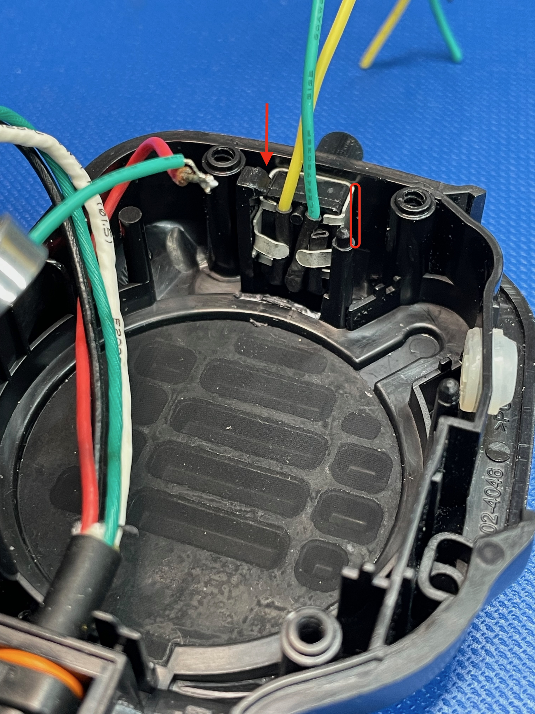
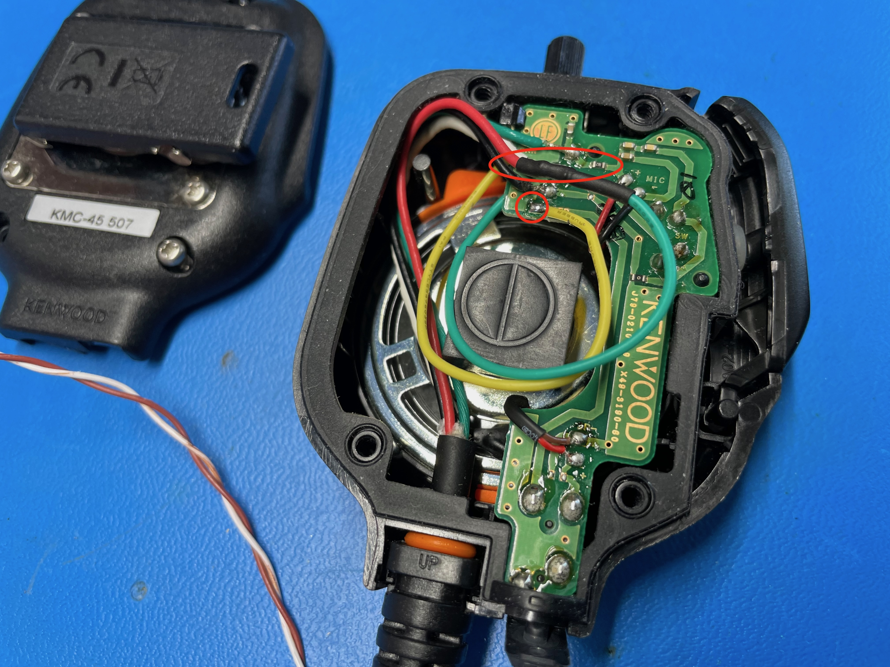
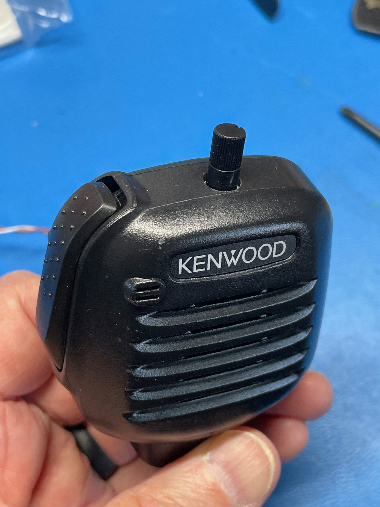

# Kenwood KMC-45 Microphone Volume Knob

## Introduction

I like to wear my KMC-45 on my ski jacket and put my radio in my pocket, which means I can't reach the volume knob on the radio easily. I couldn't find a high quality Kenwood-pinout radio with a volume knob on it, so I decided to mod mine. Here's the final result.

## Parts List

* 1 kΩ mini potentiometer from a [kit like this](https://www.amazon.com/dp/B071ZX42VV)
* 6 mm shaft [knob](https://www.amazon.com/dp/B07WNLX4H8)
* [Epoxy](https://www.amazon.com/J-B-Weld-8265S-Cold-Weld-Reinforced/dp/B0006O1ICE?th=1)
* Small wire, solder, head shrink tubing

## Steps

Here are the steps to reproduce, instructables-style.

### Disassemble the radio

Unscrew these four screws.

There are a couple of gaskets that help keep the water out of the microphone. Pay attention to where everything goes.

### Drill a hole

You'll need to get all of the electronics out of the way before you drill. The hole diameter is 9/32". This is the trickiest part, because there's very little room for this potentiomter in the top of the mic body. Center the hole between the two screw bosses and slightly off center front-to-back...closer to the front of the mic body by maybe 1/16". Drill from the outside starting small and going up in 1/32" increments to create a clean, smooth hole in the plastic. The KMC-45 is made of durable plastic, and drilling in increments work very well to keep the hole clean.

### Remove part of the speaker retainer plastic.

This step is necessary because the pot barely fits into place. Even after you remove this material, there's plenty of speaker retainer remaining in the mic body. So this piece can be sacrified. I used precision wire cutters to make incisions in the piece and then needle nose pliers to pull the plastic out.

### Solder pigtails onto the potentiometer

Solder and heat shrink the pigtails.

### Insert the pot into the mic body

First bend the contacts up against the potentiometer body. Then bend the two meter mounting tabs over top of the wires. The pot won't fit if you don't do this.

### Epoxy the pot into place

There's no screw mount for this potentiometer, so you'll have to glue it. I used JB Weld. With a toothpick, carefully apply epoxy along the two sides of the pot. Be sure to clean off any epoxy on the screw bosses, circuit board clip, and top lips of the microphone body. Otherwise the mic may not go back together easily. Just use a clean toothpick to scrape the excess off.

### Solder and reassmbele

The red wire is the speaker positive wire. Unsolder that from the circuit board. Solder one of the pot pigtails to the board. Splice the other pigtail onto the red wire. Then route the wires as shown to keep the wires out of the way when you reassemle the mic.

### Attach a knob

You may or may not want a knob. The potentiometer itself looks fine without a knob. I thought a knob would be easier to grip in my ski gloves.

## Electrical Considerations

A 1 kΩ potentiometer is probably too big of a resistance value at full range, but I had trouble finding a smaller one, e.g. a 200 Ω version, that was physically small enough to fit in the mic housing. I also tried putting (approx) 100 Ω, 200 Ω, and 300 Ω resisters in parallel to reduce the overall range of the potentiometer. This definitely helped improve the useful range of the pot, but parallel resistors produce a non-linear resistance curve when used with a linear potentiometer, as you can see from the chart below. I didn't really like the effect this had on the volume range of the speaker. The other factor is that an external earpiece with the microphone is very loud, and I wanted the extra resistance of the 1 kΩ pot at full range to reduce that volume when using an ear pieace. So I stuck with just the 1 kΩ pot.

